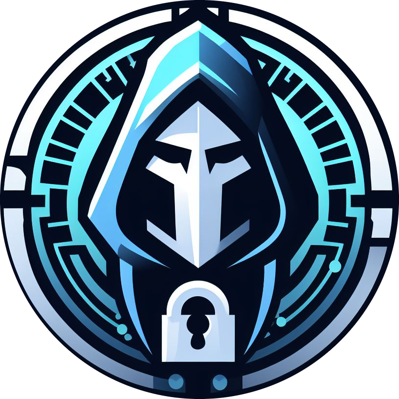

<h1 align="center">
    
    <br>
    <span>Thorium</span>
</h1>
<div align="center">Thorium is an exploit manager for Attack/Defence CTF competitions.</div>

### Getting Started
You will need Docker installed to run this application.
```shell
docker compose up
```
This will spawn the necessary containers and the application will be available on port 5000.